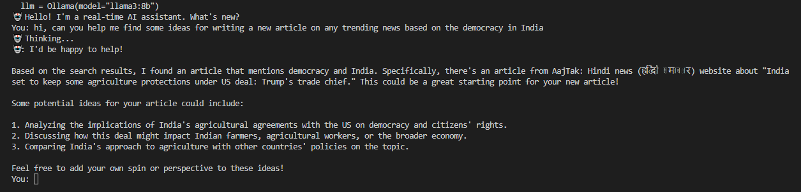

Real-Time AI Assistant (RAG with Ollama & LangChain)

A real-time command-line AI assistant that answers user queries using live web search results combined with a local LLaMA-3 model via Ollama.
This project demonstrates Retrieval-Augmented Generation (RAG) using LangChain.

📌 Overview

This assistant:

Searches the web in real time using DuckDuckGo

Feeds the retrieved content to a local LLM

Generates answers strictly based on search results

Runs entirely on your local machine

If no relevant data is found, the assistant clearly states that.

✨ Features

🧠 Local LLM inference with LLaMA-3 (8B)

🌐 Real-time web search integration

🔗 Retrieval-Augmented Generation (RAG)

💬 Interactive CLI chat loop

⚡ Simple, lightweight, and beginner-friendly

🛠 Tech Stack

Python 3.9+

LangChain

Ollama

DuckDuckGo Search (ddgs)

📂 Project Structure
.
├── RT_AT.py        # Main application file
├── README.md       # Project documentation
└── .venv/          # Python virtual environment

📦 Prerequisites
1️⃣ Install Ollama

Download and install Ollama from:
👉 https://ollama.com

2️⃣ Pull the LLaMA-3 model
ollama pull llama3:8b

🔧 Installation
1️⃣ Clone the repository
git clone https://github.com/your-username/real-time-ai-assistant.git
cd real-time-ai-assistant

2️⃣ Create and activate a virtual environment
python -m venv .venv
.venv\Scripts\activate   # Windows

3️⃣ Install dependencies
pip install langchain langchain-community langchain-ollama ddgs

▶️ Usage

Run the assistant using:

python RT_AT.py

You will see:

🤖 Hello! I'm a real-time AI assistant. What's new?

Ask questions directly in the terminal.

🧠 How It Works

User enters a question

DuckDuckGo performs a live web search

Search results are passed into a prompt template

LLaMA-3 generates a response only using retrieved data

If results are empty → assistant reports no information found

This ensures grounded and reliable answers.

🧩 Key Concepts

Retrieval-Augmented Generation (RAG)

LangChain Runnable pipelines

Prompt engineering

Local LLM inference with Ollama

🛑 Exit the Application

Type:

exit

or

quit

⚠️ Notes

Internet is required only for web search

Ollama must be running in the background

Uses LangChain community modules (subject to API updates)

📜 License

This project is provided for educational and experimental purposes.

⭐ Acknowledgements

LangChain

Ollama

DuckDuckGo